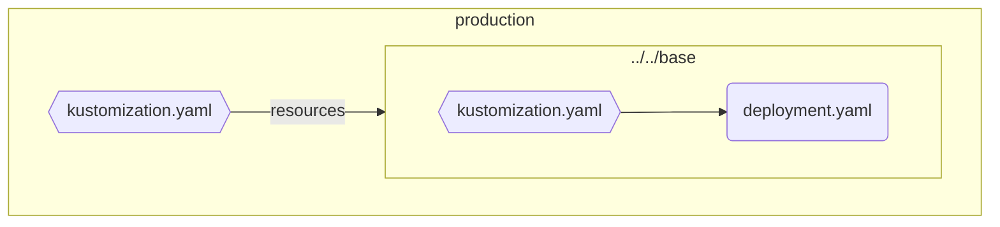
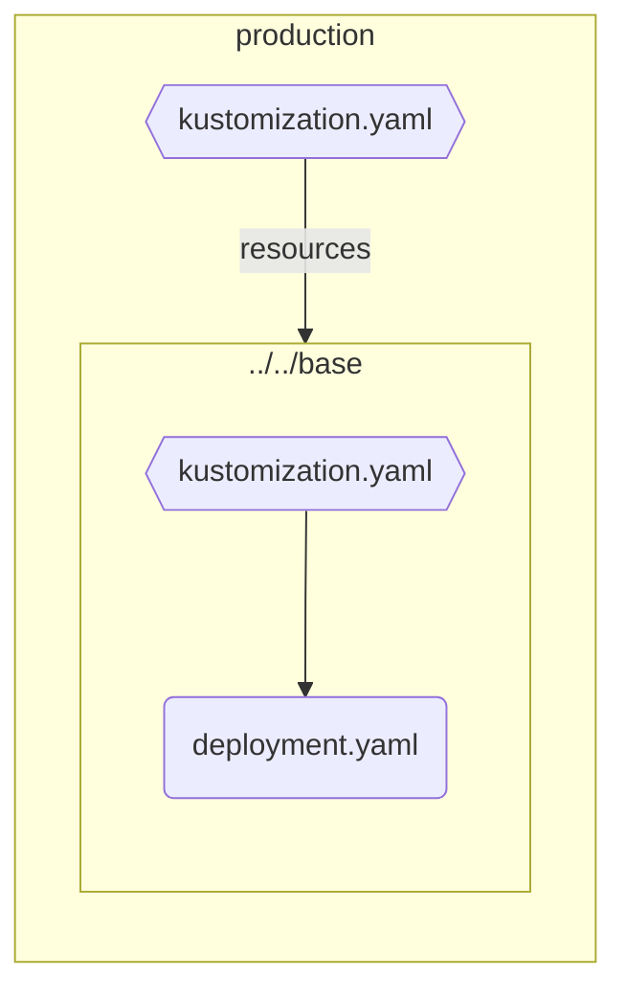

# Kustomize Markdown Graph

## Local binary build

For local build, run `./build.sh` on your machine.

## Local binary execution

Run the following steps:
* Navigate to the directory, where your `kustomization.yaml` file is located
* Run the executable file you created previously inside that directory

By now, the resulting markdown syntax will be printed on your console. So take that and put it in your README.md.

## Create Left-Right oriented graph

Run the follwoing command in a directory which contains a `kustomization.yaml` file.

```sh
kustomize-markdown
```

Example:

If you want to try that out, go to the directory `./sample/overlays/production/` in this repository and run the above command.

You should now see the below output on your console:

<pre>

</pre>

Which results in the following graph:


## Create Top-Bottom oriented graph

If you want to have a graph which is oriented from top to bottom, append `-td` to the command:

```sh
kustomize-markdown -tb
```

Which results in the following graph:



