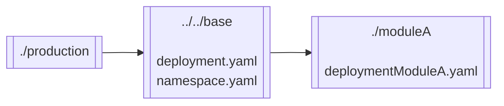
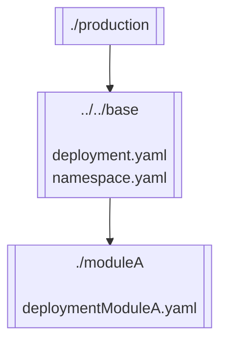
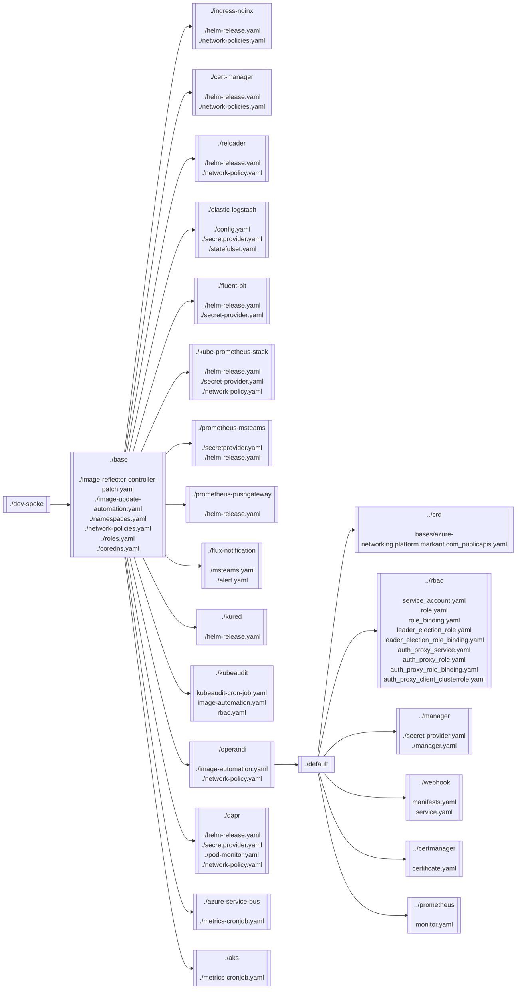

# Kustomize Markdown Graph

## Disclaimer

*At the moment, only kustomize dependencies under the `resources` section are inlcuded in the resulting markdown graph.*

## Binary build

The local build (see below) will create a executable with the name `kustomize-markdown` under `/bin`.

### MacOS
Run `./build-darwin.sh`.

### Linux
Run `./build-linux.sh`.

For easy use, add the binary folder to your `PATH`:
```sh
PATH=$PATH:$(pwd)/bin
```

## Binary execution

Run the following steps:
* Navigate to the directory, where your `kustomization.yaml` file is located
* Run the executable file you created previously inside that directory

By now, the resulting markdown will be printed on your console.

## Graph generation

```sh
# Left-Right oriented graph
kustomize-markdown

# Top-Bottom oriented graph
kustomize-markdown -tb
```

## Examples

### Simple example
The examples below are related to `./sample/overlays/production/`.

```sh
cd ./sample/overlays/production/
```

**Left-Right**

The command...

```sh
kustomize-markdown
```

...will generate the following output...

<pre>

</pre>

...which will create the following graph:


**Top-Down**

The command...

```sh
kustomize-markdown -tb
```

...will generate the following output...

<pre>

</pre>

...which will create the following graph:


### More complex example


