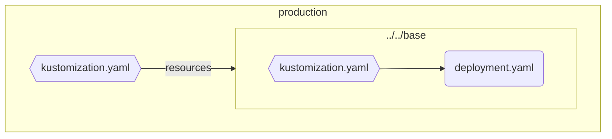
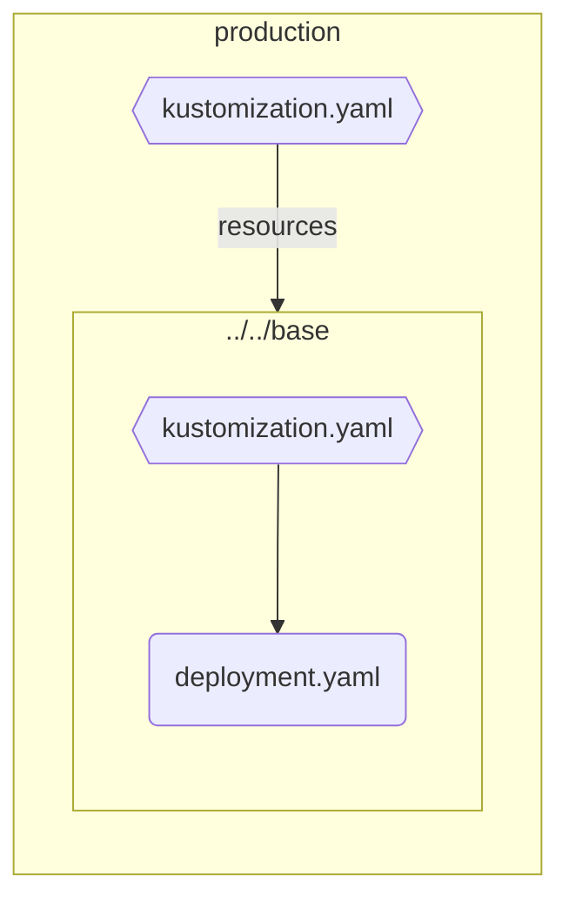

# Kustomize Markdown Graph

## Binary build

For local build, run `./build.sh` on your machine. This will create linux and windows executables with the name `kustomize-markdown`.

## Binary execution

Run the following steps:
* Navigate to the directory, where your `kustomization.yaml` file is located
* Run the executable file you created previously inside that directory

By now, the resulting markdown will be printed on your console.

### Graph generation

```sh
# Left-Right oriented graph
kustomize-markdown

# Top-Down oriented graph
kustomize-markdown -td
```

Which results in the following graphs:

Left-Right


Top-Down


